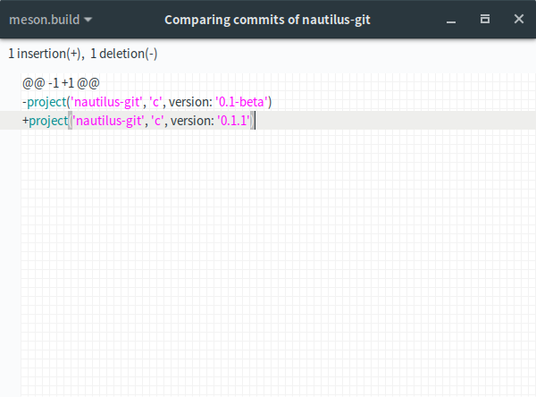

# nautilus-git

Nautilus/Nemo extension to add important information about the current git directory

## Screenshots

<div align="center"></div>

<div align="center"></div>


## Requirements:

### Running dependencies

- `python2`
- `git`

#### For Nautilus :

- `nautilus-python`:
  - Archlinux : `python2-nautilus`

#### For Nemo:

- `nemo-python`
  - Archlinux : `nemo-python`

### Building dependencies

- `meson` >= `0.40.0`
- `ninja`

## How to install

### Fedora 24/25/26

#### Nautilus
```bash
sudo dnf copr enable heikoada/nautilus-git
sudo dnf install nautilus-git
```

#### Nemo

### Ubuntu (14.04/16.04/16.10/17.04)

#### Nautilus

```bash
sudo add-apt-repository ppa:khurshid-alam/nautilus-git
sudo apt-get update
sudo apt-get install nautilus-git
```

#### Nemo


### Archlinux

#### Nautilus
```bash
yaourt -S nautilus-ext-git
```

#### Nemo


### Manual installation

1- Install requirements

2- Clone the repository

```bash
git clone https://github.com/bil-elmoussaoui/nautilus-git
```

3- Build it!

```bash
cd nautilus-git
meson builddir --prefix=/usr -Dfile_manager=[nautilus|nemo]
sudo ninja -C builddir install
```


4- Restart Nautilus

```bash
nautilus -q
```

## How to uninstall

```bash
sudo ninja -C builddir uninstall
```

## Credits

The `nautilus-git-symbolic` icon was designed by gitg design team.
